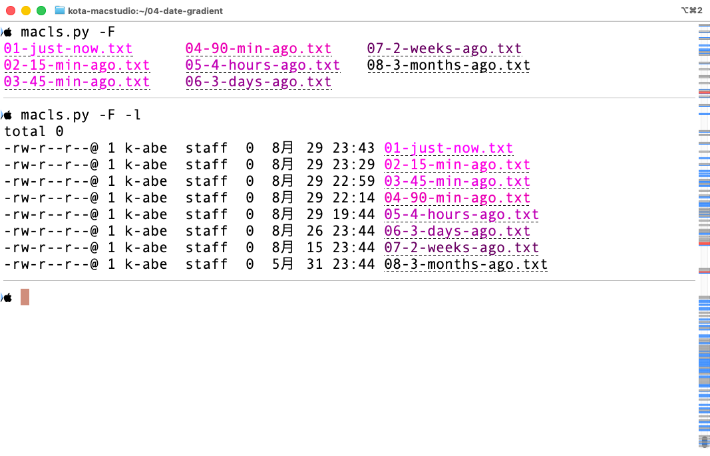
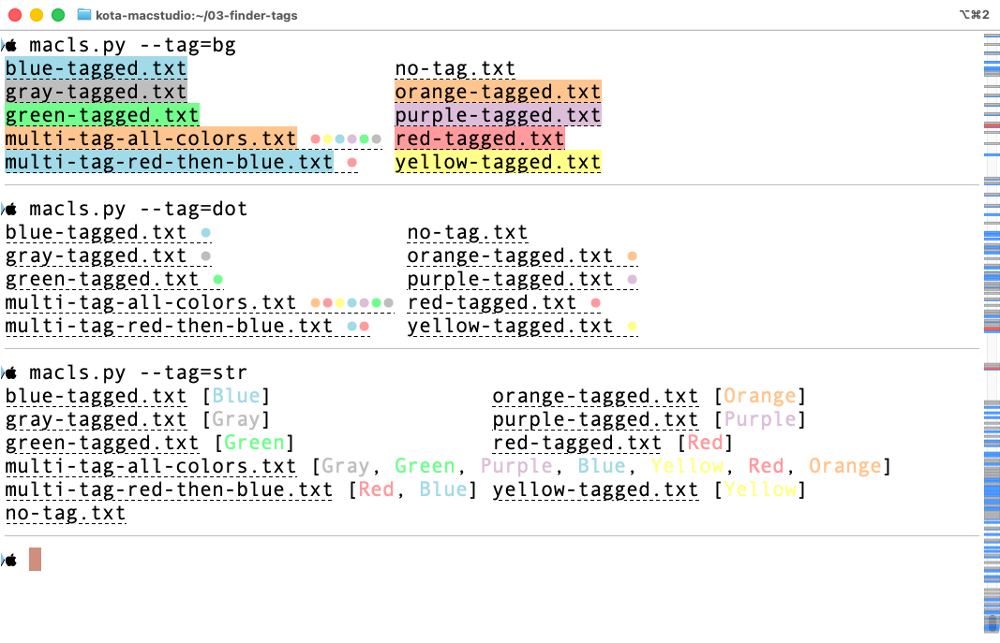
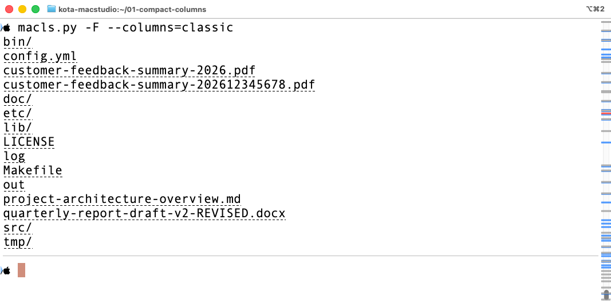
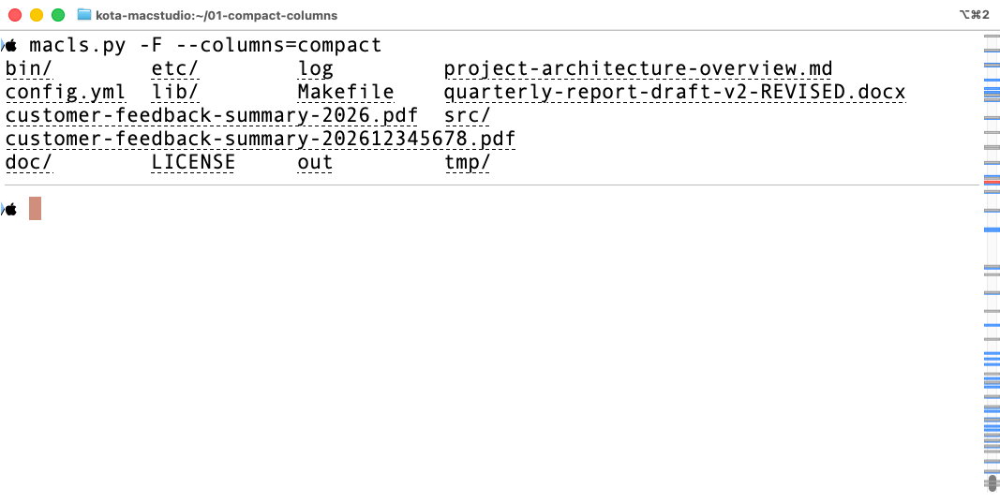
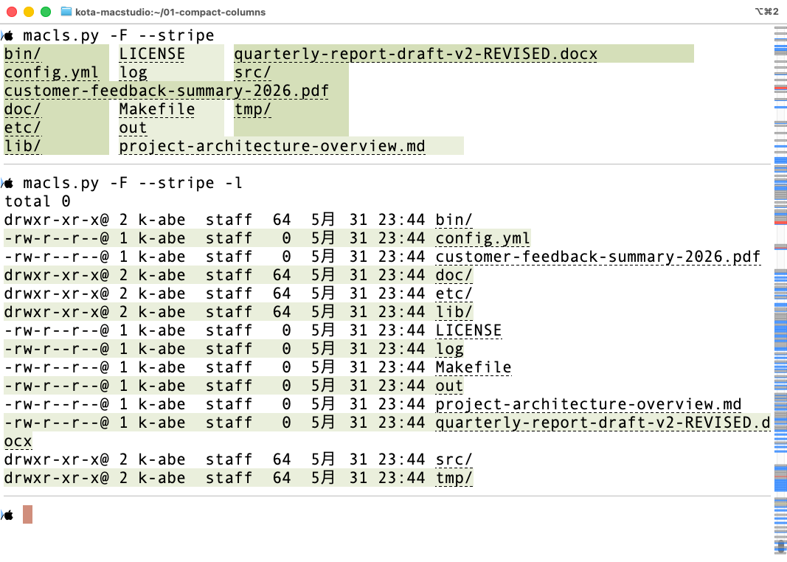
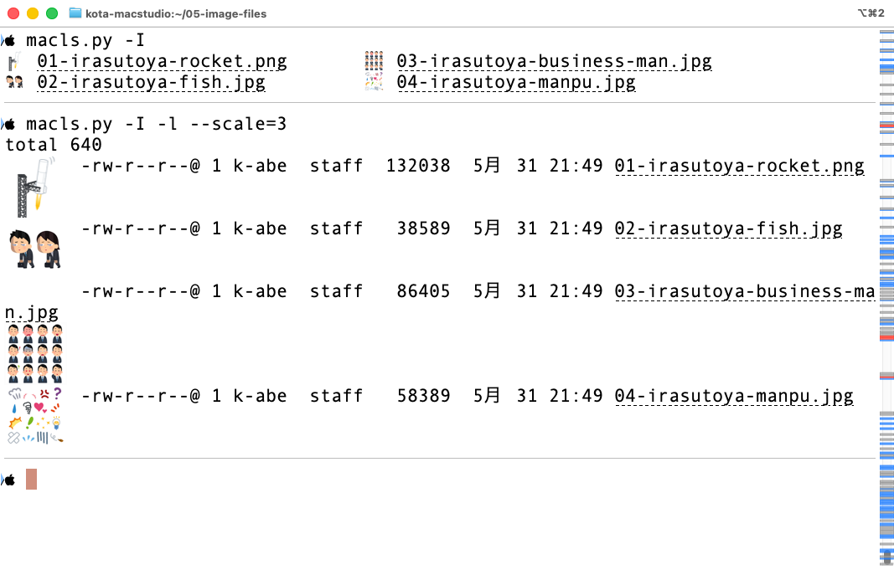
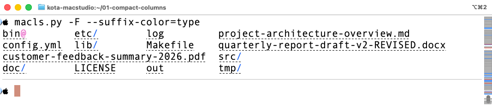
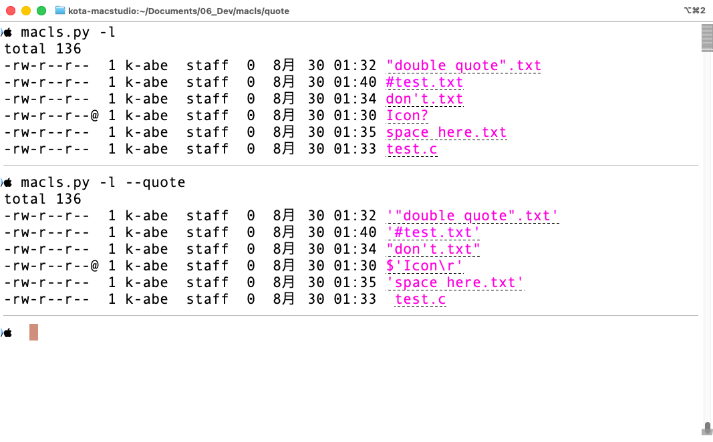

# *macls.py*

A dependency-free, single-file Python 3 script that's a drop-in colorized
replacement for macOS's `ls`.

日本語版は [README-ja.md](README-ja.md) を参照してください.

Most of this program was written by [Claude Code](https://claude.com/claude-code).

## Features

### 🎨 Modification-time gradient

Where standard `ls` colors filenames by file type, *macls.py* colors them by
what actually changed recently: a name's **foreground** fades along a
recency gradient, bright for a file you just touched and dim for one you
haven't opened in months.

<p align="center">
  
</p>

Every name is colored by how recently it changed — 5 min / 30 min /
1 hour / 2 hours / 1 day / 1 week / 1 month / older — so the file you're
mid-edit on jumps out at a glance, with no need for `-t` or a mental
timestamp comparison.

### 🏷️ Finder tags as background color

Tag a file in Finder, see it in the terminal:

- With `--tag=bg` (the default), the most recently added tag's color
  becomes the entry's background. Any other tags show as small dots
  after the name.
- With `--tag=dot`, no background is used — every tag shows as a small
  dot after the name instead.
- With `--tag=str`, every tag's name is appended after the entry as a
  bracketed list, e.g. `report.pdf [Work, Urgent]`, colored to match
  each tag.

<p align="center">
  
</p>

### 📐 Compact columns that don't collapse

Conventional `ls -C` sizes every column to the single longest name in the
listing — one long filename and the whole grid degrades toward one
column. *macls.py*'s default `--columns=compact` instead lets a longer filename span multiple column slots on its own, keeping the rest of the grid tight.

| `--columns=classic` | `--columns=compact` |
|---|---|
|  |  |

### 🦓 Striped columns

`--stripe` tints alternating columns (or rows, in `-l`/`-1`) so a wide
listing stays easy to scan line-by-line. It accounts for the
`--columns=compact` layout too: an entry that spans multiple column slots
still stripes as a single band, based on the column it starts in.

<p align="center">
  
</p>


### 🖼️ Inline image thumbnails (iTerm2)

With `-I`, image files (such as `.png`, `.jpeg`, and `.pdf`) show a
thumbnail next to their name using iTerm2's inline image protocol — no
`open` or separate viewer needed.

You can enlarge the image with the `--scale` option, though it only
takes effect with `-1` or `-l` — multi-column output ignores it.

<p align="center">
  
</p>

### 🔗 Clickable filenames

Every filename shown by *macls.py* is a hyperlink to its `file://` URL. You can Cmd-click to open it in Finder (iTerm2 only).

On iTerm2, filenames are shown with an underline to indicate a hyperlink. You can disable underlining in iTerm2 settings (Settings > Advanced > Underline OSC 8 hyperlinks to off).

### 🔣 Suffix coloring

`--suffix-color=type` colors `-F`'s `/ @ * = |` indicators by file type.

<p align="center">
  
</p>

### 💬 Quoting

`--quote` wraps names containing spaces or
shell meta-characters in shell-safe quotes, so a listing can be pasted
straight back into a command line.

<p align="center">
  
</p>

### 🚀 Easy to deploy

*macls.py* is implemented in a single Python file.
No external module or compilation is required.
It works by just dropping `macls.py` into a directory in your PATH.

### And more

- `-B` bolds directory names
- `--group-directories-first` lists directories first
- `--theme`/`--base-fg` tune the gradient for light or dark terminal backgrounds
- If unsupported options are passed, falls straight back to the real `ls`

## Requirements

- Python 3.9+ (recent macOS's `/usr/bin/python3` should work)
- macOS (Finder tags and `-I` thumbnails are macOS/iTerm2-only; basic
  listing and coloring also work on Linux, including WSL2)
- [iTerm2](https://iterm2.com/) recommended, for `-I` thumbnails and clickable filenames

## Install

```bash
chmod +x macls.py
```

Put it on your `PATH`, or alias it in your shell config:

```bash
alias ls='/path/to/macls.py -BF --stripe --suffix-color=type --fg-mode=date --tag=bg --quote'
```

## Usage

```bash
./macls.py
./macls.py -la ~/Desktop
./macls.py -I -1 --scale=2 ~/Pictures
./macls.py --stripe --tag=str
```

Full option and color reference: **[macls.md](macls.md)**.

## How it works

Enumerating/sorting directories and `-l`'s long-format output are
delegated to the system `ls(1)`, so they never drift from real `ls`
behavior. Everything else — Finder tag lookup, recency colors, display
width, multi-column layout — runs in pure Python 3 with no external
processes or third-party packages.
